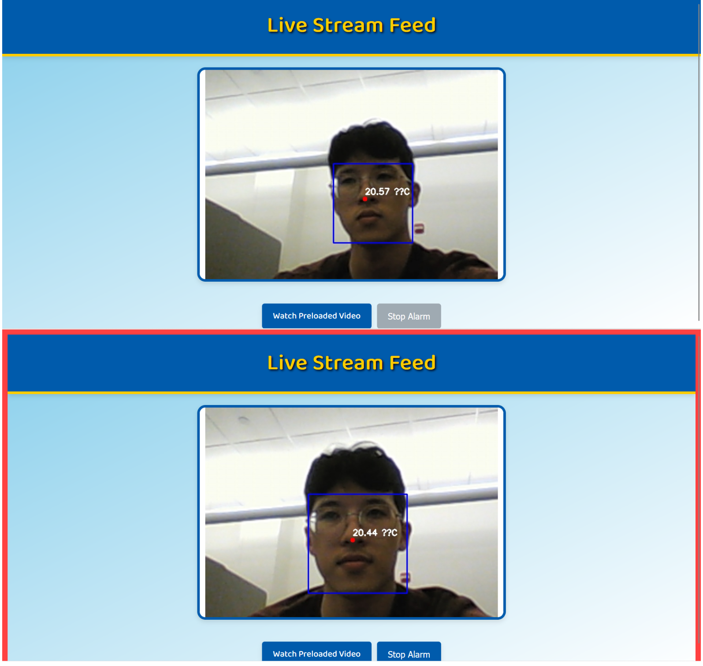
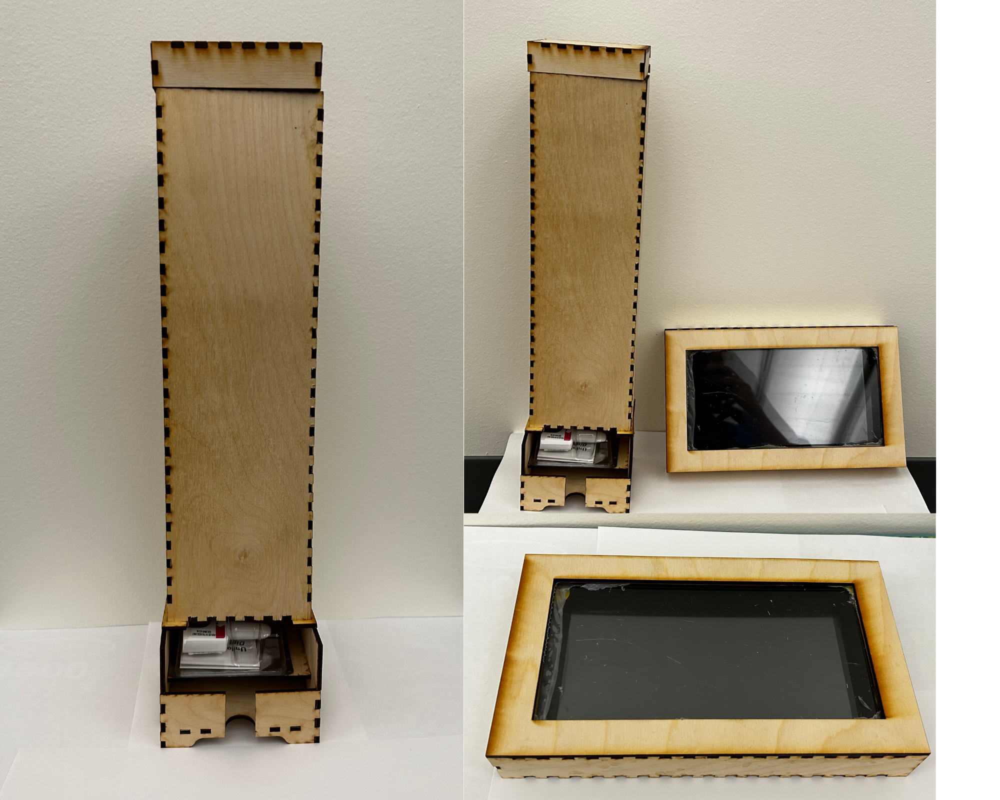
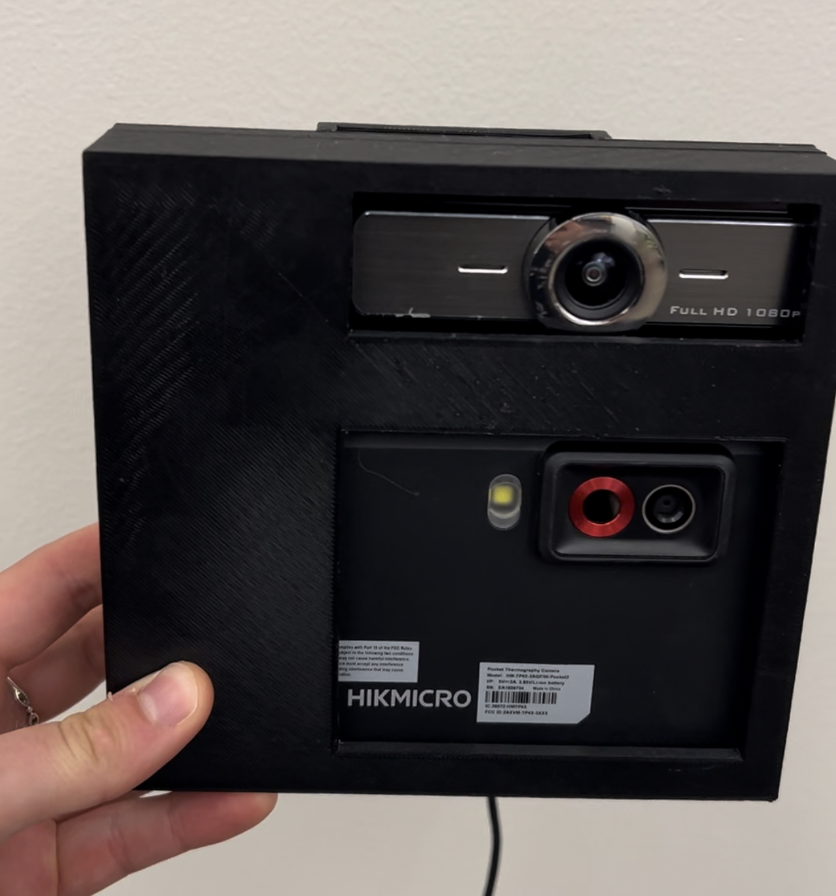
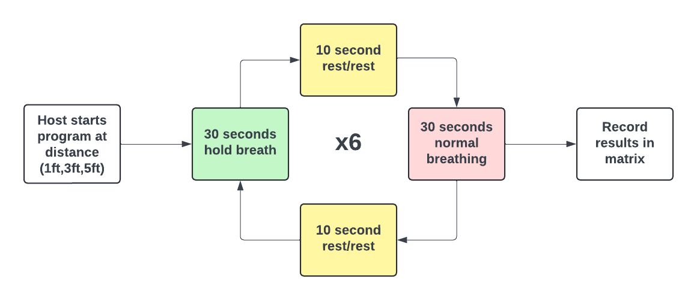

# NaloxSAVER
[Click Me to See a Product Demo](https://www.youtube.com/watch?v=KXeRJUEDPso)

## Motivation
In 2024, the Centers for Disease Control and Prevention (CDC) estimated that over 105,000 people in the U.S. died from drug overdoses. Opioid overdoses occurs when there are so many drugs in the body that the individual becomes unresponsive and cannot breathe on their own. After 3-5 minutes without oxygen, brain damage begins, soon followed by death. Survival in the event of an opioid overdoses depends solely on getting oxygen to the brain. There is however a life saving drug, naloxone, that if administered within this critical three-minute period can reverse the effects of an overdose. 

Detecting an overdose can be difficult, with symptoms including unresponsiveness and slowed, shallow, or stopped breathing. It is often challenging to distinguish if a person is sleeping or overdosing in public settings.

Numerous efforts have been made by the White House and public health organizations throughout the opioid epidemic. A barrier to many of the previous approaches is that many individuals who would benefit from them are not in the mental or physical state to utilize them. 

Our product aims to address these shortcomings and introduce a new technology to automate overdose detection.  

## NaloxSAVER Product

NaloxSAVER is a web interface program that incorporated thermal infrared and RGB camera footage to track individuals breathing patterns and alert of possible overdoses in public spaces. 

NaloxSAVER is designed to be installed in public spaces, such as train cars or public libraries. The system includes a tablet interface with a live video stream interface, a naloxone dispenser located next to the tablet, and two stacked cameras (thermal and RGB) to monitor passengers' breathing patterns. Each passenger's nose region and average temperature are tracked every second and stored internally. By detecting temperature changes between frames, the system can identify individuals experiencing a potential overdose and trigger an alarm.  

The interface features a large screen with a live video feed, a "turn off alarm" button, and a "Narcan instructions" button. When an overdose is detected, the screen perimeter will blink red and white, accompanied by an alarm to alert bystanders. Users can click the "Narcan instructions" button to view an informational video from the CDC on administering the drug.

### Software
For our thermal infrared camera, we used Hikmicro's Pocket2 which has a resolution of 49,152 pixels with a 50° × 37.2° field of view. For the RGB camera, we used a full HD 1080p compact webcam. We aligned our thermal and RGB cameras on the same plane and matched the zoom levels to our best ability. This alignment was achieved through adjustments in x-offset, y-offset, and zoom. Both cameras are kept in a static position to ensure these variables remain constant in each frame.

For facial recognition, we used Google's open-source model, Mediapipe. Mediapipe plots six key landmarks on the face (eyes, ears, nose, and mouth), which allowed us to extract only the nose point. We then overlaid these coordinates onto the thermal camera footage to calculate temperature data via our pixel color conversion equation. 

To make NaloxSAVER technology more versatile and applicable to a public space, we created a "person" class within our program that allowed the system to track multiple people and store their temperature history simultaneously. Instances of the person class are maintained and updated relative to the subjects last detected position. As long as a person stays within 75 pixels of their last detected location, the same instance will be update. If the person was not detected for more than 10 seconds (ie. moved outside 75 pixels), their instance was deleted from the people list to increase the overall efficiency of the program. 

To detect an overdose, we measure the average temperature around a person's nose once per second and store this data in memory. We compare each new temperature measurement with the previous one. If the temperature difference is less than 0.125°C, it indicates no breathing was detected. If this condition persists for seven consecutive seconds, we determine that the person is having an overdose and trigger the alarm. However, if the temperature difference exceeds 0.125°C at any point, the counter resets to 0, because breathing has been detected then the overdose detection process starts over.

### Hardware 
In addition to our software detection interface, we created 3D models to hold the camreras in a static position and a naloxone dispenser. Our naloxone dispenser was inspired by a candy dispenser and fit to the dimensions of Narcan nasal spray units The tablet holder dimensions are based on an Amazon Fire tablet, and the dispenser is designed to fit ten Narcan nasal spray units. 

## Testing
To test the accuracy of our product, we performed six rounds of breathing exercises at three different distances (1ft, 3ft, 5ft). The tests are structured as follows: 

We recorded the results in a binary confusion matrix and calculated accuracy along with pixel coverage. The confusion matrix also allowed us to easily identify type I and II errors. Testing was consistently done on the same participant to minimize variability. 

## Results
### 1 Foot Away
Of 36 total trials, we recorded 18 true negatives, 16 true positives, 2 false positives, and 0 false negatives. This gave us a 94.4% overall accuracy rating. Our precision rate was 88.9%, resulting in a 10% type I error frequency. Our recall rate was 100% with 0% type II error. At a 1 foot distance, the individual's face covers approximately 66,706 pixels, which is around 20% of the total frame. 

### 3 Feet Away
With the individual 2 feet from the camera, we recorded 15 true negatives, 12 true positives, 2 false positives, and 6 false negatives. This gave us a 77.1% overall accuracy rating. Our precision rate was 66.7%, resulting in a 28.6% type I error frequency. Our recall rate is 80% with a 20\% type II error frequency. At 3 feet, the individual's face covers 11,641 pixels, which is about 3.7% of the total frame.

### 5 Feet Away
At 5 feet distance from the camera the system detected 16 true negatives, 10 true positives, 8 false positives and 2 false negatives. This produced a 72.2% accuracy rate. Our precision rate is 55.6%, resulting in an 33.3% Type I error frequency. Our recall rate is 83.3% with a 16.7% Type II error frequency. At 5 feet, the individuals face was covering 7,657 pixels which is about 2.5% of the total frame. 

### Disscusion
Our results demonstrate a marked decrease in accuracy as the distance between the subject and the camera increases. The accuracy decreases as distance increases, as seen from 94% at 1 foot to 75% at 3 feet and finally to 72% at 5 feet. This trend can be linked to the reduction in pixel coverage of the subject's face as the distance increases. The accuracy decrease from 3 feet to 5 feet is less dramatic, indicating a potential saturation point in accuracy deterioration. At this range, the system's accuracy reaches a lower bound, suggesting that further reductions in resolution have diminishing returns. The stabilization in results between 3 feet and 5 feet show that the system's accuracy has already been compromised by reduced detail from pixel coverage, and additional decreases will have progressively smaller impacts on accuracy performance.

To maintain a 94% accuracy rate at increasing distances we have create a recommendation for camera resolution. At 3 feet, we believe a minimum of a 541,249 pixel resolution thermal camera will maintain accuracy ratings. At 5 feet, we recommend upgrading to around 798,720 pixel thermal camera. 

## Limitations and Future Work
Our system provided a comprehensive proof of concept that also revealed several key limitations that should be addressed in future work. 

### Pixel Coverage and Saturation 
One significant limitation is the impact of distance on pixel coverage and detection accuracy. Our findings indicate a notable decrease in accuracy as the subject moves further from the camera, primarily due to a reduction in the number of pixels covering the face. This was likely due to the resolution of our thermal camera and capability to perform at high levels with greater distances. 

To address the camera limitations, upgrading the system’s resolution with higher-resolution cameras could reduce the impact of less pixel coverage at greater distances. 

### Enviroment
This study was conducted in a controlled environment, which does not reflect potential real-world implementations. Factors such as lighting variations, external impacts on temperature (ie. doors opening), multiple subjects and subject movement were controlled so our results are exclusively evaluating accuracy.

Evaluating the system’s usability and effectiveness in real-world settings will be crucial for its successful deployment and ensuring it meets the needs of end users. This may include testing different lighting conditions, using multiple subjects in a frame, and having subjects move around the frame. Understanding how these factors affect pixel coverage and accuracy could educate future adjustments to the system’s design.

### System Training
Our product used frame by frame temperature detection using a pixel color to temperature equation. While we use MediaPipe which is pre-trained for facial detection, our breathing detection system is very adaptive. A limitation to this approach is that our system is not trained to understand breathing patterns and have the ability to mediate errors.

To address this, future work could explore training data sets to increase accuracy and reliability. This would allow for types of breathing patterns to be better handled and could decrease type II error frequency. It would also allow for better testing effectiveness and make strides towards deployment measures.

